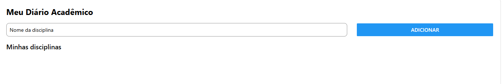
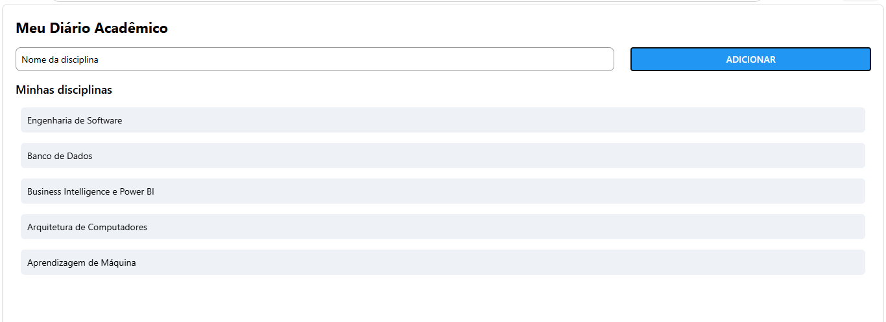

# Meu Diário Acadêmico

App feito em React Native (Expo) para cadastro rápido de disciplinas do semestre.
Atividade de consolidação de: criação de projeto Expo, Core Components, import/export, StyleSheet e Flexbox.

## Como foi criado

npx create-expo-app@latest MeuDiarioAcademico --template blank

## Como rodar

npx expo install react-native-safe-area-context
npx expo start

## Funcionalidades

- Cadastro de disciplinas via TextInput + botão (Pressable com efeito de pressionado)
- Lista de disciplinas cadastradas
- Switch "Mostrar apenas obrigatórias" (estado controlado, sem filtro aplicado ainda)
- Layout construído com Flexbox (linha para input/botão, coluna para tela geral)
- Rótulos centralizados em `labels.js`, importados no `App.js` e nos componentes

## Prints

## Estrutura

- `App.js` — tela principal, gerencia o estado da lista
- `labels.js` — textos/rótulos centralizados
- `components/DisciplinaInput.js` — input + botão de cadastro
- `components/DisciplinaList.js` — renderização da lista