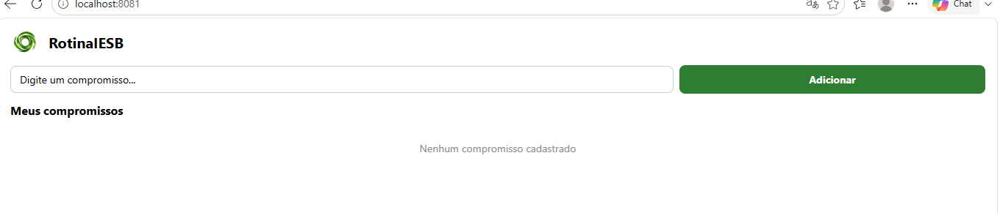
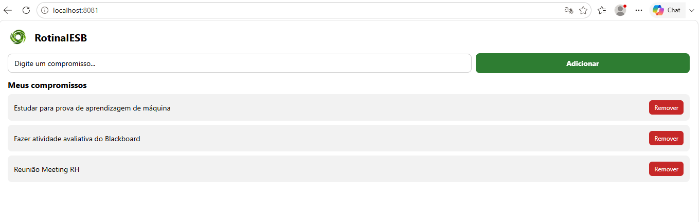
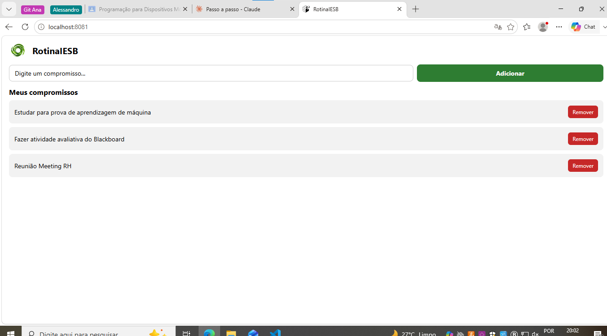

# RotinaIESB

Organizador simples da rotina acadêmica do aluno no IESB — cadastro de
compromissos (aula, estudo, trabalho, lazer), visualização da lista,
remoção de itens e persistência local com AsyncStorage.

## Como o projeto foi criado

```
npx create-expo-app@latest RotinaIESB --template blank
npx expo install @react-native-async-storage/async-storage react-native-safe-area-context
```

## Como rodar

```
npx expo start
```

## Persistência (useEffect)

- **Carregamento**: `App.js`, primeiro `useEffect` (array de dependências
  vazio `[]`) — lê o AsyncStorage com a chave `@rotina_iesb_compromissos`
  e faz `JSON.parse` ao montar o componente.
- **Salvamento**: `App.js`, segundo `useEffect` (dependência
  `[compromissos]`) — grava no AsyncStorage com `JSON.stringify` sempre
  que a lista muda.

## Arquivos criados

- `labels.js` — rótulos de texto usados no app
- `components/CompromissoInput.js` — campo de texto + botão de adicionar
- `components/CompromissoList.js` — lista de compromissos com remoção

## Prints

<!-- Adicione aqui os prints: tela vazia, tela com itens, tela após reabrir o app -->

- Tela vazia:
  

- Tela com itens:
  

- Tela após reabrir o app:
  